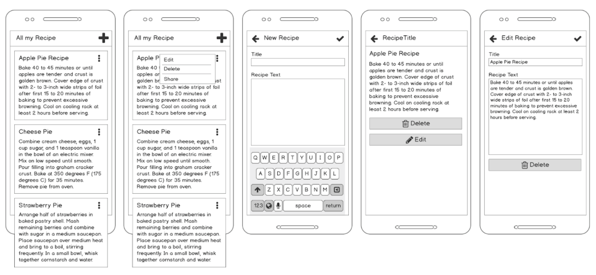
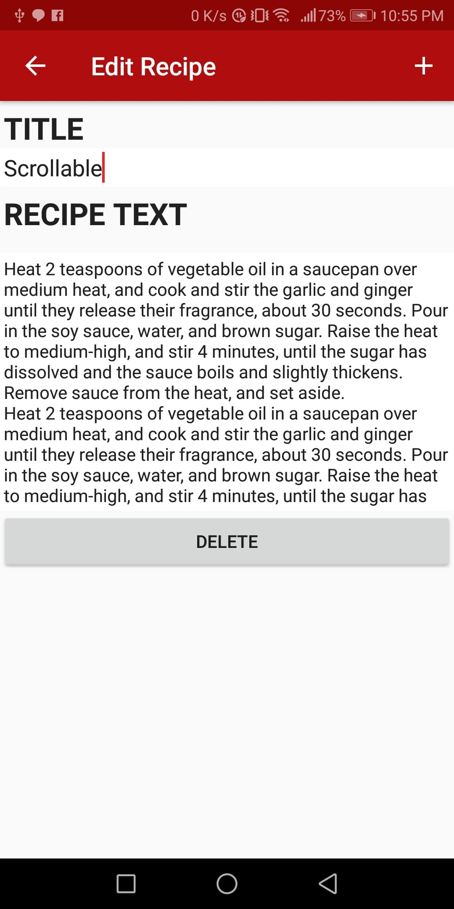
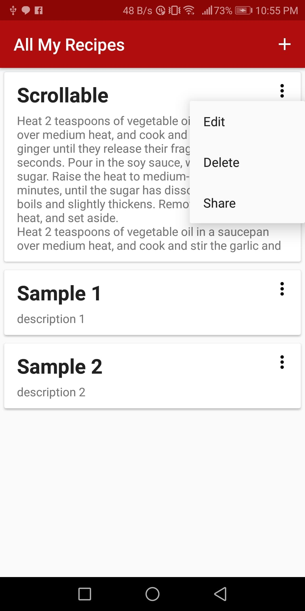
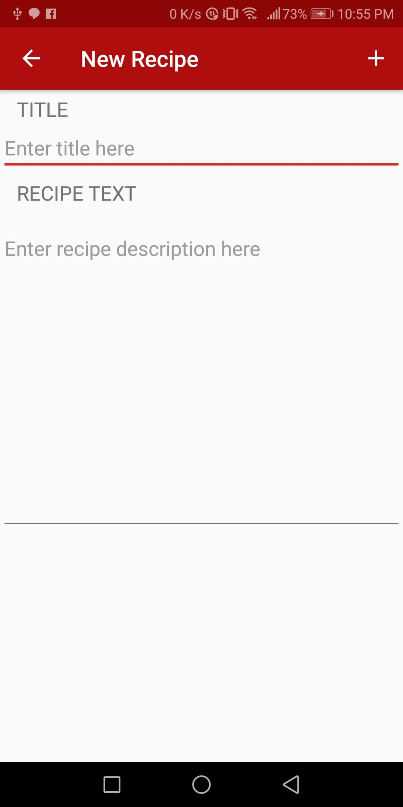
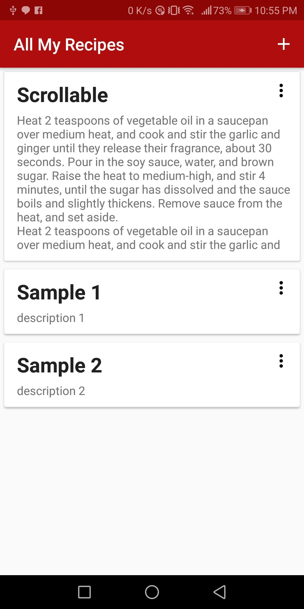
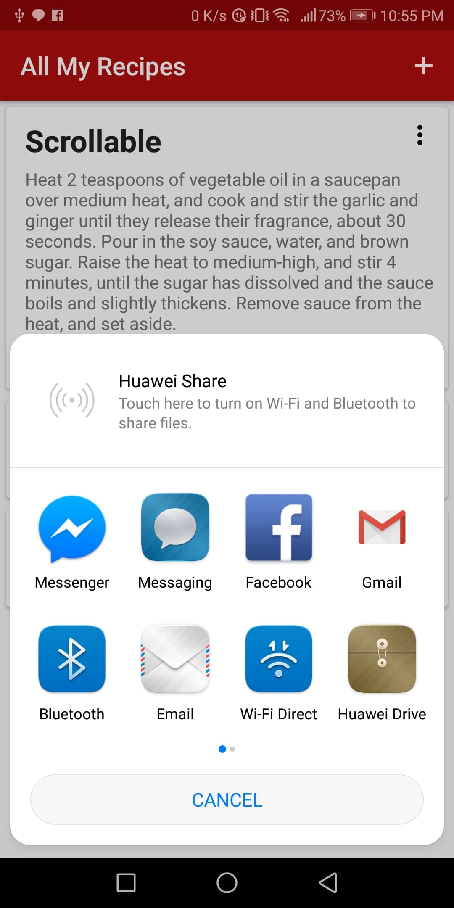
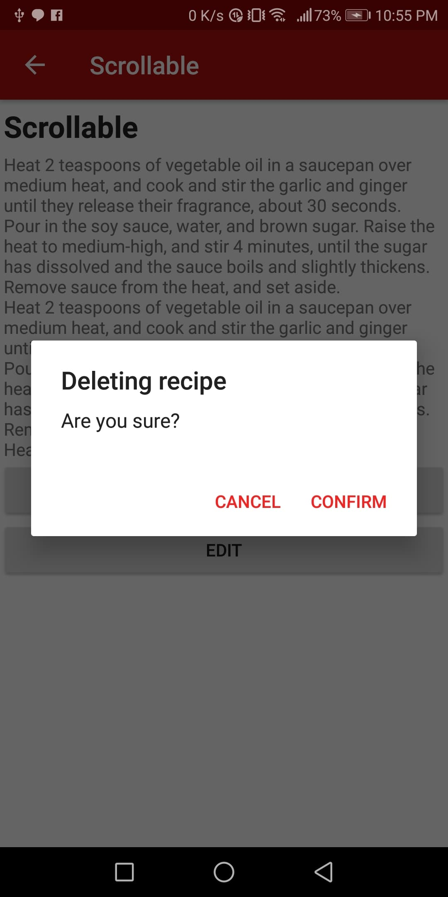
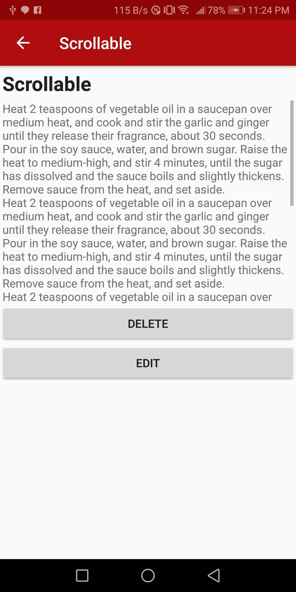

# MyRecipes2
##### An application that enables users to store and edit recipes

### Resources Used
* Android Studio 3.0.1 using API 21
* SQLite
* Recycler View

### Given Task

### Sample Screenshots

